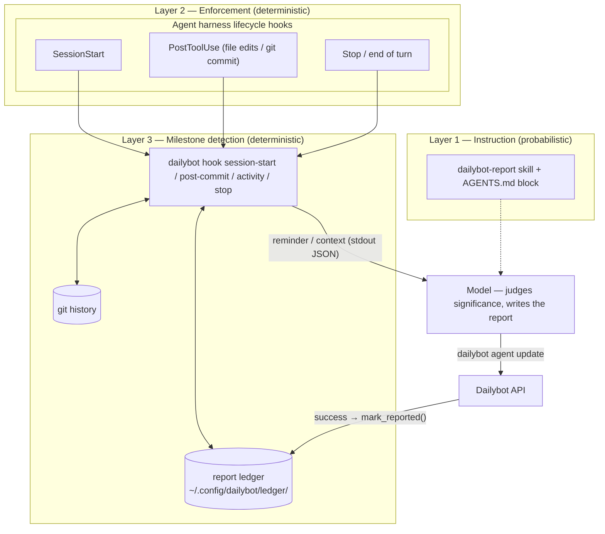
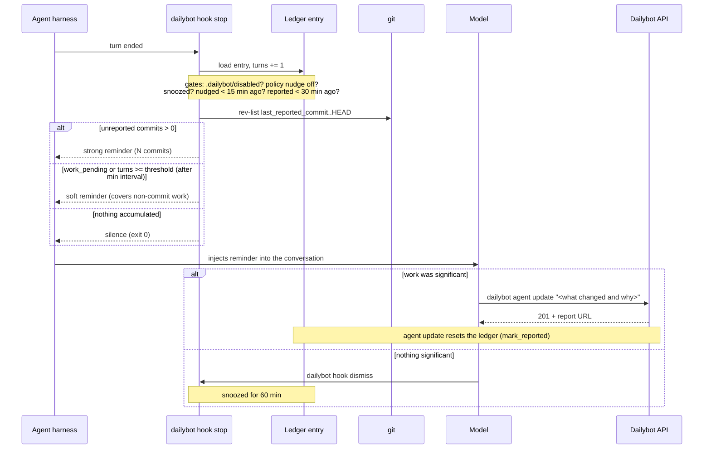
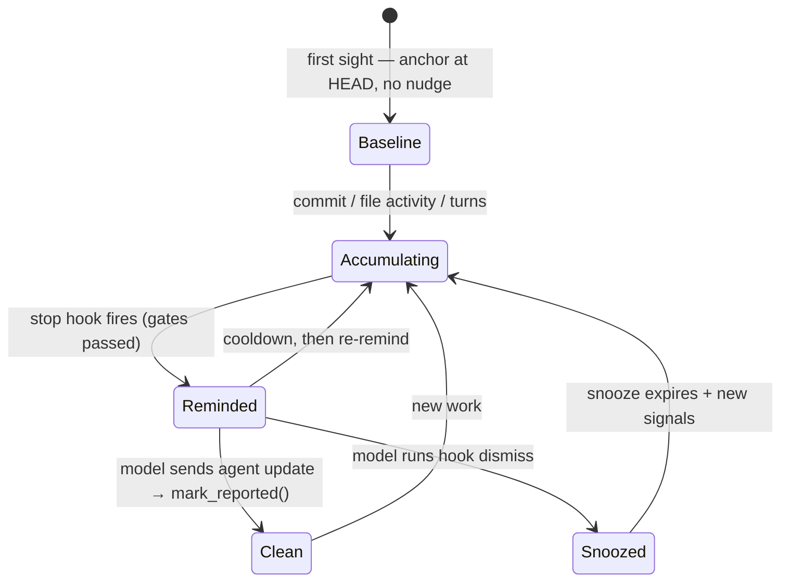

# Agent Hooks & the Report Ledger

How the CLI makes AI coding agents send Dailybot progress reports
**proactively and autonomously** — without the developer reminding them and
without trusting the model's memory.

This document covers the `dailybot hook` command group, the local report
ledger that backs it, and how agent harnesses (Claude Code, Cursor, Codex,
Copilot, Gemini CLI, …) wire into it. The per-agent rollout (hook config
templates, skill onboarding) lives in the companion skill repo
([`DailybotHQ/agent-skill`](https://github.com/DailybotHQ/agent-skill)); this
file is the source of truth for the CLI side.

---

## The problem

Prompt-layer instructions ("send a report after each completed task") are
**probabilistic**: in long sessions the instruction competes with thousands
of tokens of code context and gets forgotten. Teams end up reminding their
developers, who end up reminding their agents. The fix is a deterministic
layer underneath the prompt layer.

## The architecture — three layers



The division of responsibility is deliberate:

| Concern | Owner | Why |
|---------|-------|-----|
| **Detecting** that unreported work exists | CLI (ledger + git + hooks) | Deterministic — fires even when the model forgot |
| **Judging** whether the work is significant | Model | It has the semantic session context; a shell script does not |
| **Writing** the standup-style report | Model | Human-First reports need the WHAT + WHY, not commit logs |

A hook never sends a report itself — it reminds the model to, at exactly the
right moment. The loop closes automatically: a successful
`dailybot agent update` resets the ledger, so reminders stop.

---

## The `dailybot hook` command group

Machine-oriented commands invoked by agent harnesses, **not** by humans.
Contract: always exit `0`, empty stdout means "nothing to do", never touch
the network.

| Command | Wired to | What it does |
|---------|----------|--------------|
| `dailybot hook session-start` | SessionStart-style hooks | Injects context: login nudge (max once per 24 h) and leftover unreported work from earlier sessions |
| `dailybot hook post-commit` | PostToolUse matching `git commit` | Records a **strong** work signal (silent) |
| `dailybot hook activity` | PostToolUse matching file writes | Records a **soft** work signal — covers research, analysis, and documents that never get committed (silent) |
| `dailybot hook stop` | Stop / end-of-turn hooks | The decision point: emits a report reminder when unreported work exists, otherwise silence |
| `dailybot hook dismiss` | Invoked by the model itself | Snoozes reminders (default 60 min) when the model judged nothing significant happened |

### Output dialects (`--format`)

`session-start` and `stop` translate their message into the calling
harness's hook protocol:

| Format | `stop` output | `session-start` output |
|--------|---------------|------------------------|
| `claude` | `{"decision": "block", "reason": "<msg>"}` | `{"hookSpecificOutput": {"hookEventName": "SessionStart", "additionalContext": "<msg>"}}` |
| `cursor` | `{"followup_message": "<msg>"}` | `{"additional_context": "<msg>"}` |
| `generic` (default) | plain text | plain text |

`generic` suits any harness that re-feeds hook stdout to the model
(Codex, Copilot, Gemini CLI, OpenCode plugins, …).

### Wiring example — Claude Code (`.claude/settings.json` or `~/.claude/settings.json`)

```json
{
  "hooks": {
    "SessionStart": [
      {"hooks": [{"type": "command", "command": "dailybot hook session-start --format claude"}]}
    ],
    "PostToolUse": [
      {"matcher": "Write|Edit|NotebookEdit",
       "hooks": [{"type": "command", "command": "dailybot hook activity"}]}
    ],
    "Stop": [
      {"hooks": [{"type": "command", "command": "dailybot hook stop --format claude"}]}
    ]
  }
}
```

Commit this file to a repo and every contributor's Claude Code session gets
proactive reporting with zero individual setup beyond `dailybot login`.
Equivalent templates for Cursor (`hooks.json`), Codex, Copilot
(`.github/hooks/`), and Gemini CLI ship with the agent skill pack.

---

## The decision flow (end of turn)



### Why two reminder tiers

- **Strong (commits).** Commits are precise completion evidence: the
  reminder states the count and fires as soon as the gates allow.
- **Soft (activity / turns).** Most agent work today is not commit-shaped —
  research, generated documents, analysis. File-write activity and the
  per-turn counter are deterministic proxies for "sustained work happened".
  The soft reminder explicitly tells the model to consider **non-commit
  work** and to either report or `dismiss`. The model judges significance;
  the ledger guarantees the question gets asked.

### Anti-noise guarantees

A reminder that fires every turn would kill adoption faster than forgetting
does. Five independent gates keep the hook quiet:

1. **Baseline on first sight** — pre-existing git history is never
   "unreported"; the first time a repo is seen, the ledger anchors at the
   current `HEAD` silently.
2. **Min interval** (default 30 min, per-repo configurable) since the last
   report — favors one aggregated report over back-to-back noise.
3. **Nudge cooldown** (15 min) — a delivered reminder is not repeated on
   the next turn.
4. **Snooze** — `dailybot hook dismiss` silences a repo for 60 min
   (configurable via `--minutes`).
5. **Hard opt-outs** — `.dailybot/disabled` (walks up from `$PWD`) and
   `"report": {"nudge": false}` in `.dailybot/profile.json` silence the
   hooks entirely.

---

## The report ledger

Per-repo bookkeeping under `<config dir>/ledger/` (honors
`DAILYBOT_CONFIG_DIR`). One small JSON file per repository, keyed by a slug
derived from the `origin` remote (`github.com__Acme__widget.json`), so **all
clones, sessions, and agents on the same machine share one entry** — that
shared entry is what deduplicates reminders across concurrent sessions.
`_global.json` holds cross-repo state (login-nudge rate limit).

```json
{
  "repo": "github.com/Acme/widget",
  "first_seen_at": "2026-06-10T12:00:00+00:00",
  "last_report_at": "2026-06-10T14:30:00+00:00",
  "last_reported_commit": "6705dbb…",
  "last_nudge_at": null,
  "last_activity_at": "2026-06-10T14:55:01+00:00",
  "work_pending": true,
  "snoozed_until": null,
  "turns_since_report": 3,
  "reported_by": "claude-code"
}
```



Properties that make it safe:

- **It is a recoverable cache, not a database.** Git history is the source
  of truth for commit signals (`rev-list <last_reported_commit>..HEAD`); a
  deleted or corrupt ledger file costs at most one extra or one missed
  reminder and heals on the next report.
- **It stores no work content.** Only timestamps, one commit SHA, a boolean,
  and a counter — the report text comes from the model's own session
  context, never from the ledger.
- **Atomic, owner-only writes.** Entries are written via temp-file +
  `os.replace` with mode `0o600` (directory `0o700`), matching the rest of
  `~/.config/dailybot/`.
- **Per-machine.** Two machines working the same repo keep independent
  ledgers; server-side dedup is a possible future enhancement.

## Per-repo policy (`.dailybot/profile.json`)

The committed repo profile gains an optional `report` block:

```json
{
  "name": "CLI",
  "default_metadata": {"repo": "cli"},
  "report": {
    "min_interval_minutes": 30,
    "nudge": true,
    "mode": "balanced",
    "soft_turn_threshold": 8
  }
}
```

| Key | Default | Effect |
|-----|---------|--------|
| `min_interval_minutes` | `30` (`20` when `mode` is `continuous` and this key is omitted) | Minimum time between reports before reminders resume |
| `nudge` | `true` | `false` silences `dailybot hook stop` for the repo entirely |
| `mode` | `"balanced"` | `"continuous"` lowers the soft-nudge thresholds for research-heavy repos |
| `soft_turn_threshold` | `8` (`5` when `mode` is `continuous` and this key is omitted) | Agent turns without a report before a soft nudge is eligible |

Invalid `mode` values are ignored (falls back to `"balanced"`). Invalid
`soft_turn_threshold` values are ignored (falls back to the mode default).
Existing repos without these keys keep the current behavior.

**Continuous mode example** — teams that want more frequent reminders for
non-commit work (research, docs, analysis):

```json
{
  "report": {
    "mode": "continuous",
    "min_interval_minutes": 20,
    "nudge": true
  }
}
```

Policy (shared, committed) lives in the repo; state (private, mutable) lives
in the per-machine ledger. Credentials live in neither — the existing `key`
prohibition still applies.

## Design constraints (do not regress)

1. **No network in hook commands.** They run on every agent turn; the hot
   path is local file reads plus at most two git subprocesses (5 s timeout).
2. **Always exit 0.** Every subcommand catches all internal exceptions and
   degrades to silence — a broken ledger must never break a developer's
   agent session.
3. **Machine output bypasses `display.py`.** Like `_print_org_list`, hook
   commands emit raw JSON/plain lines via `click.echo` because the consumer
   is a harness parsing stdout (see AGENTS.md rule 9).
4. **Reminders instruct, never automate.** Hook output asks the model to
   report or dismiss; it must never embed content that auto-sends a report
   without the model composing it.

## Troubleshooting

| Symptom | Check |
|---------|-------|
| No reminders ever fire | `dailybot hook stop` manually after a commit — output? Then check `.dailybot/disabled`, `report.nudge`, and that the harness hook config actually invokes the CLI |
| Reminders fire for old history | Delete the repo's ledger file — the baseline re-anchors at current `HEAD` on next sight |
| Double reminders across agents | Expected to be impossible (shared per-repo entry + cooldown); verify both agents use the same `DAILYBOT_CONFIG_DIR` |
| Hook output breaks the harness | Use the right `--format`; `generic` is plain text, `claude`/`cursor` are JSON |
| Stale "leftover work" at session start | Send a catch-up report, or `dailybot hook dismiss` |
